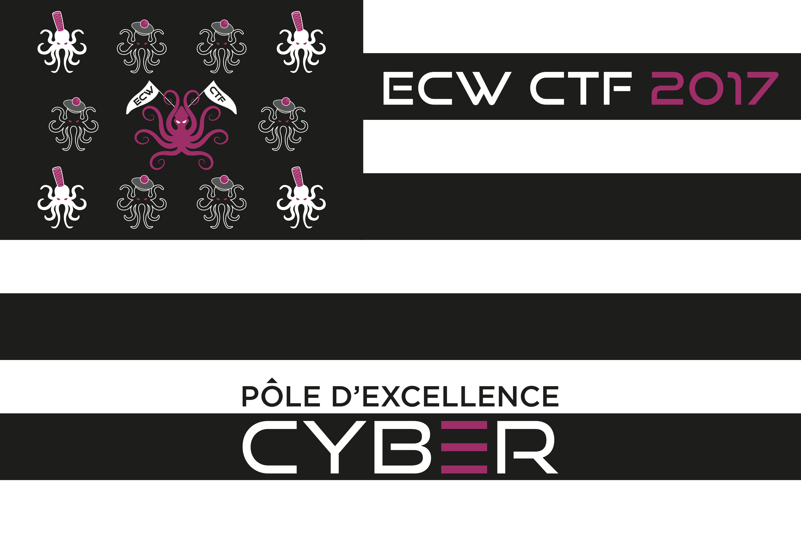
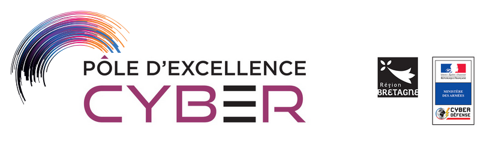

L'European Cyber Week 2017, de son petit nom ECW, est un évènement comportant un challenge à l'échelle européenne, destiné aux étudiants et organisé avec le soutien du ministère de la Défense et de la région Bretagne.

La première phase du challenge de l'ECW consistait en un CTF qui a durée 2 semaines à la fin du mois d'octobre 2017. Ce CTF permet de qualifier les finalistes pour la seconde phase qui aura lieu le 29 novembre à Rennes.

Le write up qui suit est donc l'explication du challenge n°2 de cracking qui se nommait "MineSweeper"

